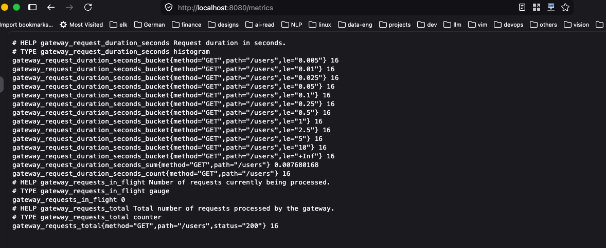
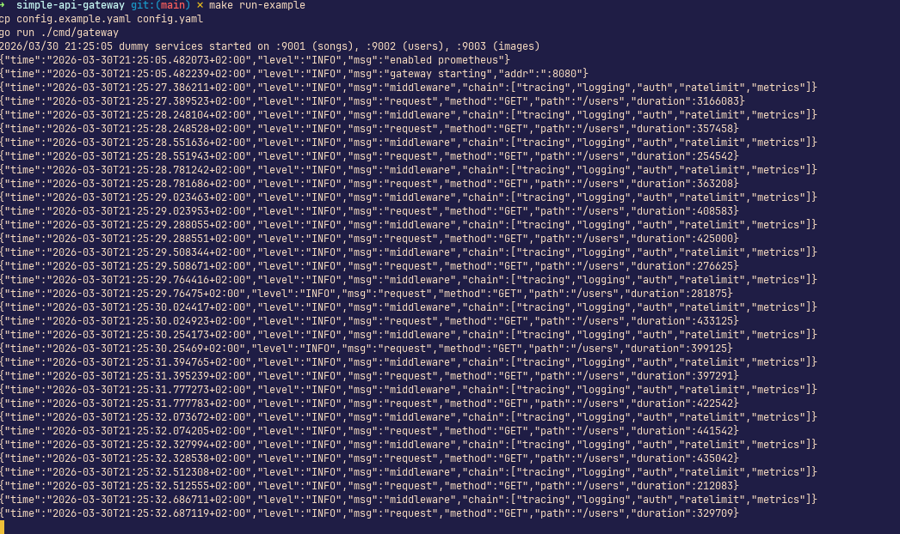
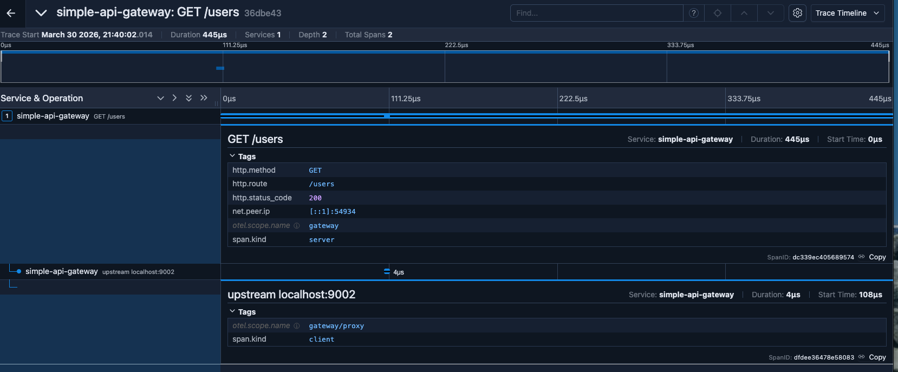
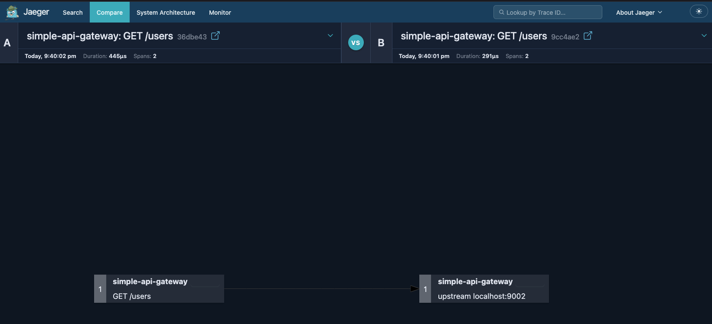

# Building an API Gateway From Scratch in Go

API gateways are one of those infrastructure components that feel intimidating from the outside. You know they handle auth, routing, rate limiting, but the internals are a black box. I decided to fix that by building one from scratch in Go, using nothing but the standard library's `net/http`. No frameworks. Just code.

This post walks through the design of [simple-api-gateway](https://github.com/realEbi/simple-api-gateway): what it does, how it's structured, and the key implementation decisions along the way.

---

## The Core Idea: A Gateway is Just a Middleware Chain

Before diving in, it's worth naming the central insight: an API gateway is fundamentally a configurable `http.Handler`. Every feature, auth, rate limiting, tracing, is just middleware wrapped around a reverse proxy.

In Go, that pattern looks like this:

```go
type Middleware func(http.Handler) http.Handler
```

A middleware takes a handler and returns a new handler that does something before or after calling the next one. Chain enough of these together and you have a gateway.

The `Gateway` struct implements `http.Handler` directly:

```go
type Gateway struct {
    config     *types.Config
    router     *Router
    middleware map[string]Middleware
}

func (gw *Gateway) ServeHTTP(w http.ResponseWriter, r *http.Request) {

    route, params := gw.router.Match(r)
    if route == nil {
        http.NotFound(w, r)
        return
    }

    handler := gw.buildChain(route)
    handler.ServeHTTP(w, r)
}
```

No magic, just a struct with a method. This also means the gateway is fully testable without a live server. You can call `ServeHTTP` directly in a test.

---

## Routing

I designed the router to handle three path patterns: exact (`/users`), parameterised (`/users/:id`), and prefix wildcards (`/users/*`). Routes are sorted by specificity at startup so more precise matches always win.

```go
func (ro *Router) Match(r *http.Request) (*types.Route, map[string]string) {
    for _, route := range ro.routes { // sorted: exact > param > prefix
        if matched, params := matchPath(route.Path, r.URL.Path); matched {
            if methodAllowed(route.Methods, r.Method) {
                return &route, params
            }
        }
    }
    return nil, nil
}
```

One deliberate limitation: `:param` segments are matched and used for routing, but the extracted values aren't injected into the request context. For the purpose of this project, learning the gateway pattern, that tradeoff was acceptable, but it's a clear gap for production use.

---

## The Middleware Chain

When a route is matched, its configured middleware is assembled into a chain and applied around the upstream proxy:

```go
func (gw *Gateway) buildChain(route *types.Route) http.Handler {
    handler := gw.proxy.Forward(route.Target)

    // Apply in reverse so the first listed middleware is outermost
    for i := len(route.Middleware) - 1; i >= 0; i-- {
        name := route.Middleware[i]
        if mw, ok := gw.middleware[name]; ok {
            handler = mw(handler)
        }
    }
    return handler
}
```

The order middleware is listed in `config.yaml` is the order requests traverse the chain, so if you list `[tracing, auth, ratelimit, logging, metrics]`, tracing wraps everything, auth runs next, and so on. Getting this ordering right matters a lot in practice.

This was designed so each built-in is registered at startup and custom middleware can be added before calling `Start()`:

```go
gw := core.NewGateway(cfg)
gw.Register("my-middleware", func(next http.Handler) http.Handler {
    return http.HandlerFunc(func(w http.ResponseWriter, r *http.Request) {
        // do something before
        next.ServeHTTP(w, r)
        // do something after
    })
})
gw.Start()
```

---

## Authentication

The auth middleware validates JWT Bearer tokens and injects verified claims into the request context:

```go
func NewAuthMiddleware(verifier TokenVerifier) Middleware {
    return func(next http.Handler) http.Handler {
        return http.HandlerFunc(func(w http.ResponseWriter, r *http.Request) {
            token := extractBearer(r)
            if token == "" {
                writeError(w, http.StatusUnauthorized, "missing token")
                return
            }

            claims, err := verifier.Verify(token)
            if err != nil {
                writeError(w, http.StatusUnauthorized, "invalid token")
                return
            }

            ctx := context.WithValue(r.Context(), claimsKey{}, claims)
            next.ServeHTTP(w, r.WithContext(ctx))
        })
    }
}
```

The middleware itself doesn't care how a token is verified, that's delegated to a `TokenVerifier` interface:

```go
type TokenVerifier interface {
    Verify(token string) (Claims, error)
}
```

This separation means swapping in a different authentication backend is a matter of implementing one interface, with no changes to the middleware itself. The active verifier is selected at startup based on the `auth.type` field in config — currently `jwt` is the built-in implementation, but plugging in something like a Keycloak OIDC verifier would just mean implementing `Verify` against Keycloak's token introspection endpoint and setting `type: keycloak` in your config:

```yaml
auth:
  enabled: true
  type: keycloak # swap without touching middleware code
  # keycloak-specific config would go here
```

Downstream handlers retrieve the injected claims with `middleware.ClaimsFromContext(ctx)`, regardless of which verifier produced them.

---

## Rate Limiting

Rate limiting uses a per-IP token bucket from `golang.org/x/time/rate`:

```go
func (rl *rateLimiter) getLimiter(ip string) *rate.Limiter {
    rl.mu.Lock()
    defer rl.mu.Unlock()

    if lim, ok := rl.clients[ip]; ok {
        return lim
    }

    lim := rate.NewLimiter(rate.Limit(rl.rps), rl.burst)
    rl.clients[ip] = lim
    return lim
}
```

This works fine for a single instance but has two limitations worth knowing: the map has no eviction, so memory grows unbounded over time; and there's no shared state across instances, so it breaks under horizontal scaling. A production system would push this to Redis. For a learning project, the simplicity is worth it.

---

## Observability

Three layers of observability are built in.

**Logging** uses Go 1.21's `slog` with configurable JSON or text output. Each request gets a structured log entry with method, path, status, and duration.

**Metrics** are exposed via Prometheus at a configurable path (default `/metrics`). Three instruments are tracked:

```
gateway_requests_total{method, path, status}
gateway_request_duration_seconds{method, path}
gateway_requests_in_flight
```

The `/metrics` endpoint itself is served before route matching, bypassing all middleware, otherwise you'd need to auth-exempt your own scraper.

**Distributed tracing** uses OpenTelemetry. The tracing middleware creates a server span for each request and propagates a `traceparent` header to the upstream, so traces stitch together across service boundaries. Spans are exported to Jaeger over gRPC OTLP.

One subtle gotcha: `tracing` must be explicitly listed in each route's middleware array. It is not in the internal `isKnownMiddleware` registry, so if you omit it, there's no warning — requests just won't be traced.

---

## Configuration

Everything is controlled by a single `config.yaml`, parsed strictly with `gopkg.in/yaml.v3`'s `KnownFields` — unknown keys are rejected at startup rather than silently ignored:

```yaml
server:
  port: 8080

routes:
  - path: /users
    methods: [GET]
    target: http://localhost:9002
    middleware: [tracing, auth, ratelimit, logging, metrics]

auth:
  enabled: true
  type: jwt
  secret: "your-secret"

rate_limit:
  enabled: true
  requests_per_second: 5
  burst: 4

metrics:
  prometheus:
    enabled: true
    path: /metrics
  otel:
    enabled: true
    endpoint: localhost:4317 # host:port only, no scheme
```

---

## Running It

```bash
# Start Jaeger for tracing
docker compose up -d

# Start the gateway + mock upstream services
make run-example

# Generate a dev JWT and hit an endpoint
make get-token
# Run this a couple of time to have some request with tracing
curl -H "Authorization: Bearer <token>" http://localhost:8080/users

# Inspect traces and metrics
open http://localhost:16686       # Jaeger UI
curl http://localhost:8080/metrics
```

---

## Observability in Action

Here's what the observability stack looks like when the gateway is running.

**Prometheus metrics endpoint**

Hitting `/metrics` exposes all three instruments in standard Prometheus text format — request counts broken down by method, path, and status code, latency histograms, and the current in-flight count.



**Structured JSON logs**

With `logging.format: json` set in config, every request produces a structured log entry. This makes logs trivially parseable by tools like Loki, Datadog, or any log aggregator.



**Jaeger trace view**

Each request generates a server span with timing and metadata. Because `traceparent` is propagated to the upstream, the full trace stitches together across the gateway and the backend service in a single waterfall view.



**Jaeger service graph**

The service graph shows the call relationships between the gateway and its upstream services, making it easy to see which services are being hit and at what rate.



## What I Took Away

Building this clarified something I'd always glossed over: the complexity in production gateways (Kong, Traefik, AWS API Gateway) isn't in the core concept, it's entirely in the operational concerns layered on top. Distributed rate limiting, hot config reloading, circuit breaking, mTLS, dynamic service discovery. The fundamental pattern, a middleware chain in front of a reverse proxy, is surprisingly approachable.

If you want to genuinely understand a piece of infrastructure, build a limited version of it. The gaps in your mental model become impossible to ignore once you're responsible for filling them.

The full source is on GitHub at [`github.com/realEbi/simple-api-gateway`](https://github.com/realEbi/simple-api-gateway).
