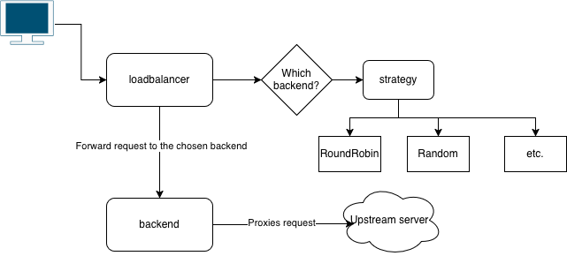

I implemented a simple HTTP load balancer from scratch in Golang to deepen my understanding of a load balancer's internal processes and to brush up on my Go skills.
This project is designed to be simple yet cover the main objectives of a load balancer. In the architecture design, I extracted its modules to have separate responsibilities, simplifying testing and future development.

## Load Balancer

The core functionality and responsibility of a load balancer is to handle incoming network traffic. In terms of network layers, there are two main types of load balancers:

- HTTP and gRPC-based, which operate at Layer 7 (the Application Layer).
- TCP/UDP-based, which operate at Layer 4 (the Transport Layer).

We can summarize the core functionality of a load balancer as follows:

- Accepts an incoming request from a client.
- Forwards the request to a backend server from its pool of backends.
- Returns the backend's response to the client.

There are many more details to the functionality of a load balancer, such as:

- Synchronous vs. streaming responses
- Different algorithms to pick the backend for each request
- Error handling
- Session affinity and sticky sessions
- Monitoring and observability techniques

And more, all of which are crucial for any production system. However, for this simple load balancer project, we will not focus on these advanced topics.

For production use cases, it's recommended to use one of the open-source, cloud-native, or managed solutions:

| Solution / Service                | Type / Role                   | OSI Layer | Notes                                                             |
| --------------------------------- | ----------------------------- | --------- | ----------------------------------------------------------------- |
| **NGINX**                         | Reverse proxy, web server, LB | L7        | Path routing is a core configuration feature (`location` blocks). |
| **Envoy**                         | L7 proxy / service proxy      | L7        | Core model: Listener → Route → Cluster; routing is fundamental.   |
| **AWS Application Load Balancer** | Managed application LB        | L7        | Supports path and host-based routing rules.                       |
| **AWS Network Load Balancer**     | Managed network LB            | L4        | TCP/UDP only; no HTTP awareness.                                  |
| **GCP HTTP(S) Load Balancer**     | Managed global application LB | L7        | Supports host and path routing globally.                          |
| **GCP TCP/UDP Load Balancer**     | Managed network LB            | L4        | No Layer-7 inspection or routing.                                 |
| **Azure Application Gateway**     | Managed application LB        | L7        | Provides host/path routing and WAF integration.                   |
| **Azure Load Balancer**           | Managed network LB            | L4        | Basic TCP/UDP distribution only.                                  |

## Simple Load balancer

In [this](https://github.com/realEbi/simple-load-balancer) project, I implemented a simple HTTP load balancer that has the following core features:

- **Traffic Proxying**: HTTP request proxying with different load balancing strategies.
- **Load Balancing Strategies:** The load balancer supports multiple strategies for selecting backend servers:
  - **Round Robin:** Distributes requests to backend servers in a circular order.
  - **Weighted Round Robin:** Distributes requests based on the weight assigned to each server.
  - **Least Connections:** Sends requests to the server with the fewest active connections.
  - **Random:** Selects a backend server randomly.
- **Health Checks:** The load balancer periodically checks the health of backend servers using a TCP dial. Unhealthy servers are temporarily removed from the rotation.
- **Request Retry:** If a request to a backend server fails, the load balancer will retry the request on a different server.
- **Configuration:** The load balancer can be configured using a JSON file (`config.json`) or command-line flags. The configuration includes the load balancer's port, request timeout, health check interval, load balancing strategy, and a list of backend servers.

### Architecture and Intent

The primary goal of this project's architecture is to be **modular, testable, and easy to understand**. The design follows the principle of **Separation of Concerns**, where each part of the system has a single, well-defined responsibility. This not only makes the code cleaner but also mimics patterns found in production systems, making it a valuable learning exercise.

By isolating logic—for instance, completely separating the _logic for choosing a backend_ from the _logic for proxying a request_—we can test each part independently and add new features with minimal side effects.

#### High-Level Overview

At its core, the load balancer's job is to receive an HTTP request and decide which backend server should handle it. The interaction between the main components can be visualized like this:



The process is as follows:

1.  The `LoadBalancer` receives a request.
2.  It asks the current `Strategy` to choose a backend from the pool.
3.  The `LoadBalancer` then uses the chosen `Backend`'s reverse proxy to forward the request.

Let's look at each component in more detail.

### Component Breakdown

#### `strategy` Module: The Brains

The most important architectural decision was to define backend selection logic using an interface. This is an application of the classic **Strategy Design Pattern**.

```go
type LoadBalancingStrategy interface {
    SelectBackend(pool []*Backend) *Backend
}
```

The `LoadBalancer` holds a variable of this interface type. This means we can create any number of strategies (Round Robin, Least Connections, etc.) that fulfill this contract. To change the load balancer's behavior, we simply swap out the implementation, without touching the `LoadBalancer`'s core code. This makes the system incredibly flexible and extensible.

#### `backend` Module: The Worker

A `Backend` is not just a URL string; it's a stateful object responsible for its own state.

```go
type Backend struct {
	Url               url.URL
	proxy             *httputil.ReverseProxy
	isHealthy         bool
	activeConnections int64
	// ...
	mu                sync.RWMutex
}
```

It tracks its health, the number of active connections, and its configured weight. It also holds the `httputil.ReverseProxy` instance that performs the actual request forwarding. The mutex ensures that its state can be safely updated and read by multiple concurrent requests and health checks.

#### `loadbalancer` Module: The Coordinator

This is the central component that ties everything together.

```go
type LoadBalancer struct {
	pool                []*Backend
	strategy            LoadBalancingStrategy
	// ...
}
```

Its responsibilities include:

- Managing the pool of `Backend` objects.
- Handling incoming HTTP traffic and using the current `Strategy` to pick a `Backend`.
- Performing periodic health checks on all backends in its pool.
- Implementing retry logic if a request to a chosen backend fails.

#### `config` Module: The Blueprint

A simple but important module responsible for loading and parsing the application's configuration from a `config.json` file. This decouples the load balancer's logic from hard-coded settings, allowing you to reconfigure it without changing the code.

### Conclusion

In this post, we walked through the process of building a simple yet functional HTTP load balancer from scratch in Go. We implemented several core features, including multiple load balancing strategies, periodic health checks, and dynamic configuration. The result is a working application that demonstrates the fundamental principles of traffic management.

More importantly, this project was a practical exploration of key software design patterns. By using an interface for our balancing algorithms (the Strategy Pattern), we created a system that is flexible and easy to extend. The emphasis on modularity and separation of concerns resulted in a codebase that is clean, testable, and easier to reason about.

While our load balancer is simple, it provides a solid foundation that could be extended in many ways. Future improvements could include:

- **More Advanced Strategies:** Implementing IP hashing for session affinity (sticky sessions).
- **Enhanced Observability:** Adding Prometheus metrics for monitoring request latency, error rates, and active connections.
- **HTTPS Support:** Adding TLS termination for secure communication.
- **Dynamic Configuration:** Implementing hot-reloading of the configuration file without restarting the service.

I hope this article has been an insightful look into the internals of a load balancer and has inspired you to build your own. Feel free to explore the complete source code on [GitHub](https://github.com/realEbi/simple-load-balancer), try it out for yourself, and even contribute your own ideas!
